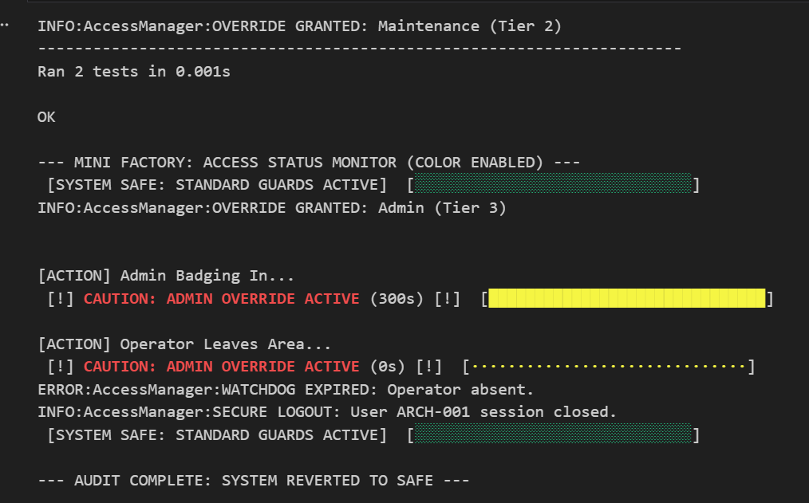

# 🔑 AccessManager: Administrative Override & Identity Service


**AccessManager** is a high-assurance identity and authorization service designed for collaborative robotics (cobots). It provides a secure **2-FA Handshake** and **Temporal Watchdog** logic to manage manual overrides in industrial environments without compromising ISO 15066 safety integrity.

## 📊 Access Status Dashboard
*Real-time ANSI-colored telemetry captured during a high-integrity system audit.*

 

| **🟢 STATE: SAFE** | **🟡 STATE: OVERRIDE** | **🔴 STATE: TIMEOUT** |
| :---: | :---: | :---: |
| Standard Guards Active | Maintenance/Admin Mode | Watchdog Expired |
| **Logic:** `is_override == False` | **Logic:** `2-FA Handshake == PASS` | **Logic:** `Elapsed > 300s` |
| **Action:** ISO 15066 Active | **Action:** Supervised Compliance | **Action:** Secure Auto-Logout |

---

## 🏗️ System Architecture

The module is architected using the **PACE** standard to ensure identity resilience during critical lab procedures.

### 1. 🛡️ 2-FA Handshake (Logic Gate)
Implements a multi-factor authentication protocol requiring both a physical token (`badge_id`) and a confirmed voice command (`voice_intent`).
* **Tiered Clearance:** Maps operators to specific compliance constants (`TIER_1` to `TIER_3`).
* **Identity Mapping:** Integrates with a local auth cache for deterministic offline verification.

### 2. 🐕‍🦺 5-Minute Watchdog (The Pulse)
A temporal monitor that ensures the system never remains in a "Compliant Override" state if the operator abandons the workstation.
* **Heartbeat:** Continually verified by the `VisionProcessor` (Neuro-Grasp).
* **Auto-Reversion:** If `operator_present` is False for > 300 seconds, the system triggers an emergency state purge.

---

## ✅ Quality Assurance & Verification

| Metric | Status | Standard |
| :--- | :--- | :--- |
| **Static Analysis** | `10.00/10` | **Pylint** (PEP 8 Strict) |
| **Unit Testing** | `18/18 PASSED` | **unittest** (Stress Tested Boundaries) |
| **Auth Protocol** | **2-FA** | Badge + Voice Intent Multi-Factor |
| **Reliability** | **PACE** | Self-healing Auth Cache |

### Automated Stress Test Battery
The system includes `test_access_manager.py`, covering 18 critical scenarios:
1.  **Identity Tiers:** Validates upgrade/downgrade paths between Maintenance and Admin levels.
2.  **Temporal Boundaries:** Verifies watchdog triggers at exactly `T+301s`.
3.  **Input Resilience:** Tests malformed, null, and case-insensitive string handling.
4.  **Chaos Engineering:** Simulates signal loss to ensure the system defaults to "Secure Mode."

---

## 🚀 Usage

### 1. Run System Audit
The diagnostic simulation demonstrates a full lifecycle from badge-in to auto-timeout:
```bash
python access_manager.py

```

### 2. Run Stress Tests

```bash
python test_access_manager.py

```

## 🛠️ Configuration

Authorization constants are managed via frozen Dataclasses to prevent runtime identity spoofing.

```python
@dataclass(frozen=True)
class AccessConfig:
    MAINTENANCE_TIMEOUT_SEC: float = 300.0  # 5-Minute Watchdog
    auth_cache: Dict[str, str] = field(default_factory=lambda: {
        "ARCH-001": "Senior Architect"
    })

```

## 📦 Dependencies

* **Python 3.10+** (Dataclass support)
* **Standard Library** (Zero-dependency deployment)

---

**Author:** Charles Austin (Principal Solutions Architect)
*Focus: Robotics Identity Management, Human-Robot Interaction (HRI), PACE Fault-Tolerance*
